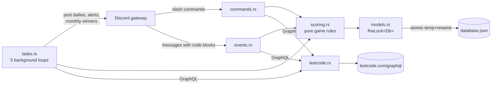

# [LeetCode Daily Bot](https://github.com/chris-straka/leetcode-daily)

A Discord bot that keeps a group of friends doing LeetCode. Every day it posts
the LeetCode daily (and one from the NeetCode 250, in order) in a fresh thread,
checks each player's solve against LeetCode's public GraphQL API, and keeps a
per-server leaderboard with a first-solver bonus, daily penalties, monthly
winners and contest reminders. It is a single async Rust binary (tokio +
poise/serenity) that keeps its state in one JSON file.



## Build, test, run

```sh
cargo test                     # 26 unit tests, no network or Discord needed
cargo clippy --all-targets -- -D warnings && cargo fmt --check
cp env .env && $EDITOR .env    # put your bot's DISCORD_TOKEN in .env
cargo run --release            # connects to Discord and registers the slash commands
```

CI (`.github/workflows/ci.yml`) runs the same fmt, clippy, test and release build.
Learning notes and a code tour are in [docs/LEARN.md](docs/LEARN.md).

## Results

Measured on `z` (Apple M4 Mini, 10 cores, 16 GB, shared with other jobs) on
2026-10-06, Rust 1.98.1.

| What | Result | Command |
| --- | --- | --- |
| Tests | 26 pass (16 game rules, 5 persistence, 3 GraphQL fixtures, 2 message parsing) | `cargo test` |
| Lint | clean with `-D warnings` | `cargo clippy --all-targets -- -D warnings` |
| Cold release build | 77 s at `-j2` | `cargo build --release -j2` |
| Release binary | 19.4 MB | `ls -l target/release/leetcode-daily` |
| LeetCode GraphQL round trip | 0.15-0.22 s per query (5 samples) | `curl` of the same queries the bot sends |

The GraphQL fixtures in `src/leetcode.rs` were checked against live responses
for the daily-challenge, recent-accepted-submissions and upcoming-contests
queries on the same day; the field names still match. The bot itself was not
run against Discord for these numbers.


## 🚀 How to Play

1. **Register:** Run `/register <your_leetcode_username>`.
2. **Solve:** Every day, the bot posts a challenge in a new thread.
3. **Submit:** Solve it on LeetCode.com, then paste your code in the Discord thread inside a code block (```).
4. **Earn:** The bot verifies your solve via the LeetCode API and awards 1/2/3 points for Easy/Medium/Hard, plus 1 for the first solver. Missing a day costs a point, and scores reset each month after the winner is announced.

## 🛠 Commands

- `/daily`: Get the link to today's daily challenge.
- `/contests`: See when the next Weekly and Bi-Weekly contests start.
- `/scores`: View the server leaderboard.
- `/ratings`: View the server LeetCode contest rating leaderboard.
- `/register`: Link your LeetCode account.
- `/random`: Get a random question.
- `/neetcode`: Get today's NeetCode 250 problem.
- `/claim`: Verify today's solves without pasting code.
- `/winners`: Past Leetcoders of the Month.
- `/channel`, `/toggle`, `/contest_setup` (Manage Server): pick the daily channel, turn the LeetCode and NeetCode dailies on or off, and pick the contest-alert channel.

## ⚙️ Discord Portal Setup

1. Enable **Server Members Intent** and **Message Content Intent** in the Discord Developer Portal under your application's "Bot" tab.
2. Invite the bot using the link below.
3. Run `/channel #your-channel` to start the Daily Question cycle.
4. Run `/contest_setup #your-channel` to start Contest Alerts.

[**Bot Install Link**](https://discord.com/oauth2/authorize?client_id=1492343278060835001&permissions=2252246490639424&integration_type=0&scope=bot+applications.commands)

[**Bot Developer Page**](https://discord.com/developers/applications/1492343278060835001/information)
